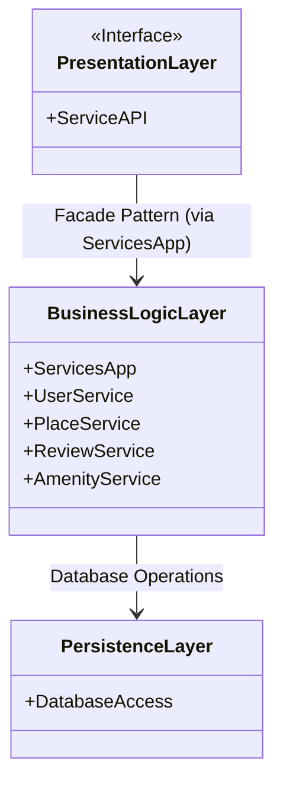
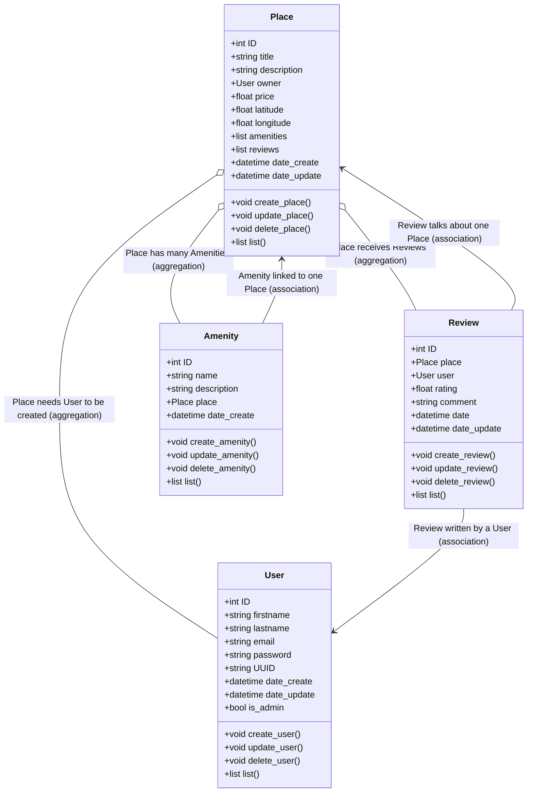
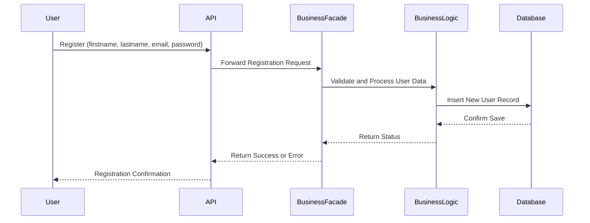
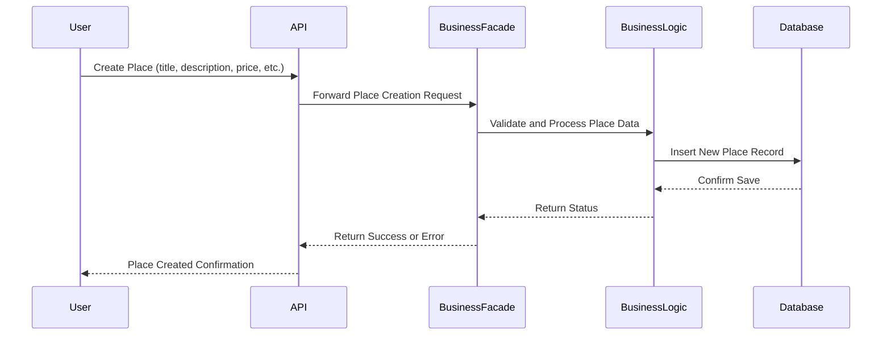
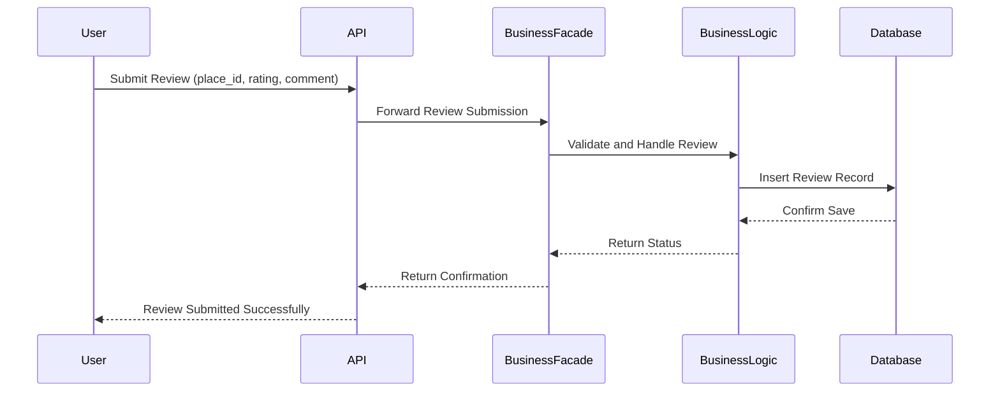
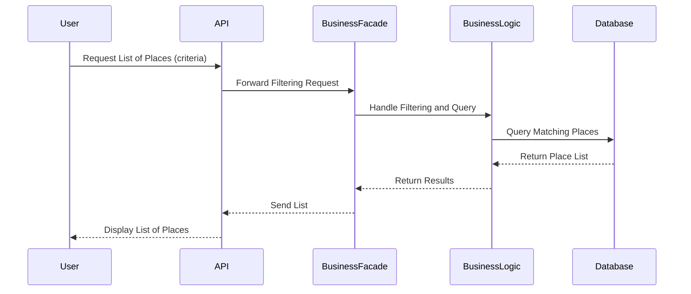

# 🏠 HBnB – Project Technical Documentation
## 📘 Introduction

This document is the technical guide for the **HBnB project**, which is a clone of the Airbnb platform.
It explains how the app is structured, how the different parts connect, and how it works step-by-step.
This documentation is here to guide the development and make sure everyone working on the project understands the system.

---
## 📦 High-Level Architecture

The app is organized into 3 main layers:
### 1. Presentation Layer
- This is where the app receives requests, usually through an API.
- It takes care of passing user inputs to the right part of the system.
- Main component: `ServiceAPI`, which talks to `ServicesApp`.
### 2. Business Logic Layer
- This is the brain of the system.
- It contains the rules and logic for users, places, reviews, amenities.
- It’s all managed through a central access point: `ServicesApp`.
- Each type of data (user, place, etc.) has its own service.
### 3. Persistence Layer
- This part communicates with the database.
- It stores and retrieves data through a single component: `DatabaseAccess`.
The whole structure is designed to keep responsibilities clean and separated.
All services go through `ServicesApp`, and only `DatabaseAccess` talks to the database.
---
## 🧠 Business Logic Layer – Class View

### ⚙️ Main Components

- **`ServicesApp`**: Central access point for all services. It's like a control panel.
- **`UserService`**: Manages user registration and login.
- **`PlaceService`**: Handles everything related to places (create, update, list).
- **`ReviewService`**: Manages user reviews for places.
- **`AmenityService`**: Manages optional features like WiFi, kitchen, etc.
Each service handles its own type of data and talks to `DatabaseAccess` to save or get info.
There’s no inheritance or shared model — each service is built independently to keep things simple.
---
## 🔄 API Interaction Flow

Each of the following diagrams shows what happens during a specific API request.
We go step-by-step from user input to the system’s response.

---
### 1. User Registration

- The user fills out the registration form.
- The request goes to `ServiceAPI`, which sends it to `UserService` through `ServicesApp`.
- `UserService` processes the info and stores the user using `DatabaseAccess`.
- A response is sent back confirming the user is created.
---
### 2. Create a New Place

- The user creates a new place by submitting data.
- `ServiceAPI` passes it to `PlaceService` via `ServicesApp`.
- `PlaceService` validates and saves the place.
- The system replies with a confirmation.
---
### 3. Add a Review

- The user writes a review for a specific place.
- The API sends the info to `ReviewService`.
- The review is saved using `DatabaseAccess`.
- A response is returned to the user.
---
### 4. List Places

- A user sends a request to search for available places.
- The API calls `PlaceService`.
- It queries the database and sends back a list of places that match the filters.
---
## ✅ Summary

This document gives a full view of how the HBnB project works behind the scenes.
We’ve seen how the system is split into layers, how services are organized, and how common requests are handled.
The idea is to keep the logic clean and modular, so it’s easier to maintain and extend later.
All the diagrams should now be used as a reference during development to stay aligned.
