## Introduction

This project uses a three-layer architecture: presentation, business logic, and data access.
The three layers present the key components of the system, their responsibilities, and their relationships.
This model ensures a clean, modular, and scalable structure.

---

## Class Documentation

### 📤 Presentation Layer

Type: Interface (API or UI)

Role: The **presentation layer**, which includes the **ServiceAPI** component, serves as the entry point of the application. It exposes services to clients (such as the user interface or external API calls) and forwards incoming requests to the business logic layer via the **ServicesApp** facade, which centralizes access to the core application services.

**Component**

-  **ServiceAPI**: Exposed access point for client interactions.

**Relationships**

- The **PresentationLayer** is connected to the **BusinessLogicLayer** via the ServicesApp facade.

---

### 🧠 BusinessLogicLayer

Type: Core business layer

Role: The **business logic layer** contains the core models and services of the application, such as **UserService**, **PlaceService**, **ReviewService**, and **AmenityService**. It processes the application's main rules and logic. This layer receives requests from the presentation layer (via the **ServicesApp** facade) and interacts with the persistence layer to manage data storage and retrieval.

**Components**

- `ServicesApp`
- `UserService`
- `PlaceService`
- `ReviewService`
- `AmenityService`

**Relationships**

- Uses **PersistenceLayer** to interact with the **database**.

---

### 💾 PersistenceLayer

Type: Data access layer

Role: Manages all interactions with the **database**, handling data storage and retrieval so that the **business logic** doesn’t have to deal with **database** details.

**Component**

- **DatabaseAccess**: Interface for read/write operations.

**Relationships**

- The **Presentation Layer** depends on the **Business Logic Layer** to process client requests.

- The **Business Logic Layer** uses the **Persistence Layer** to access and modify data in the **database**.

---

## Class Diagram (Mermaid)

```mermaid
classDiagram
    %% Présentation
    class PresentationLayer {
        <<Interface>>
        +ServiceAPI
    }

    %% Domaine Métier
    class BusinessLogicLayer {
        +ServicesApp
        +Basemodel
        +UserService
        +PlaceService
        +ReviewService
        +AmenityService
    }

    %% Accès aux Données
    class PersistenceLayer {
        +DatabaseAccess
    }

    %% Relations
    PresentationLayer --> BusinessLogicLayer : Facade Pattern (via ServicesApp)
    BusinessLogicLayer --> PersistenceLayer : Database Operations
```

## Conclusion

The diagram provides a visual overview of the main components and their logical connections.
This modeling lays the foundation for development by ensuring a consistent and well-structured design.
It represents an important first step before implementing the application's features in code, improving clarity, maintainability, and scalability.
