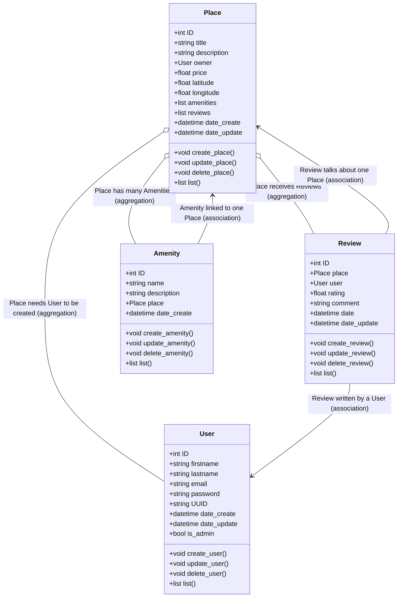

## Introduction

This project is a mock application designed to manage users, places, amenities, and reviews.  
A class diagram is used to represent the structure of the project, including the different classes, their attributes, methods, and the relationships between them.  
The goal is to establish a clear data model using concepts such as inheritance, aggregation, composition, and association.

---

## Class Documentation

### 👤 User

**Attributes**

- `ID`  
- `firstname`  
- `lastname`  
- `email`  
- `password`  
- `UUID`  
- `date_create`  
- `date_update`  
- `is_admin`  

**Methods**

- `create_user()`  
- `update_user()`  
- `delete_user()`  
- `list()`  

**Relationships**

- A **User** owns one or more **Places**.  
- A **User** writes **Reviews**.  

---

### 📍 Place

**Attributes**

- `ID`
- `title`
- `description`
- `owner`
- `price`
- `latitude`
- `longitude`
- `amenities`
- `reviews`

**Methods**

- `create_place()`
- `update_place()`
- `delete_place()`
- `list()`

**Relationships**

- A **Place** needs a **User** to be created (**aggregation**).
- A **Place** can include multiple **Reviews** (**aggregation**).
- A **Place** can have **Amenities** (**aggregation**).

---

### ⭐ Amenity

**Attributes**

- `ID`
- `name`
- `description`
- `place`
- `date_create`

**Methods**

- `create_amenity()`
- `update_amenity()`
- `delete_amenity()`
- `list()`

**Relationships**

- An **Amenity** needs a **Place** to exist (**composition**).

---

### 📝 Review

**Attributes**

- `ID`
- `place`
- `user`
- `rating`
- `comment`
- `date`

**Methods**

- `create_review()`
- `update_review()`
- `delete_review()`
- `list()`

**Relationships**

- A **Review** is linked to a **Place**.
- A **Review** is written by a **User**.

---

## Class Diagram (Mermaid)

## Conclusion

The diagram provides a visual overview of the main entities in the project and the logical connections between them.
This modeling lays the foundation for development by ensuring a consistent and well-structured design.
It represents an important first step before implementing the application's features in code.