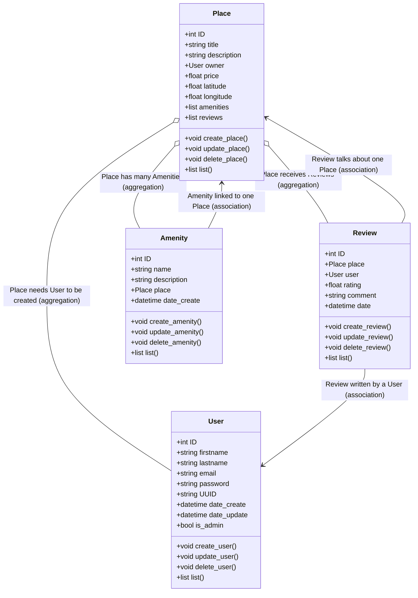

# Class diagram

```mermaid
classDiagram
    class User {
        +int ID
        +string firstname
        +string lastname
        +string email
        +string password
        +string UUID
        +datetime date_create
        +datetime date_update
        +bool is_admin
        +void create_user()
        +void update_user()
        +void delete_user()
        +list<User> list()
    }

    class Place {
        +int ID
        +string title
        +string description
        +User owner
        +float price
        +float latitude
        +float longitude
        +list<Amenity> amenities
        +list<Review> reviews
        +void create_place()
        +void update_place()
        +void delete_place()
        +list<Place> list()
    }

    class Review {
        +int ID
        +Place place
        +User user
        +float rating
        +string comment
        +datetime date
        +void create_review()
        +void update_review()
        +void delete_review()
        +list<Review> list()
    }

    class Amenity {
        +int ID
        +string name
        +string description
        +Place place
        +datetime date_create
        +void create_amenity()
        +void update_amenity()
        +void delete_amenity()
        +list<Amenity> list()
    }

    Place o-- User : Place needs User to be created (aggregation)
    Place o-- Amenity : Place has many Amenities (aggregation)
    Place o-- Review : Place receives Reviews (aggregation)
    Review --> Place : Review talks about one Place (association)
    Review --> User : Review written by a User (association)
    Amenity --> Place : Amenity linked to one Place (association)

```
