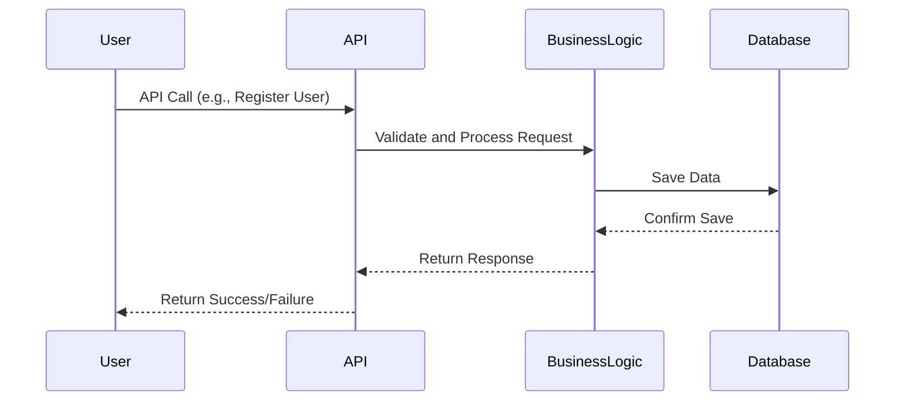

# 👤 Situation – User Registration

This documentation describes the flow and components involved when a new user registers an account in the application.

---

## 📘 Documentation

### 🎭 Actors

| Actor             | Description                                                                 |
|-------------------|-----------------------------------------------------------------------------|
| **User**          | The individual who wants to create a new account.                           |
| **API**           | Receives the user's registration request and delegates it.                  |
| **BusinessFacade**| A layer that coordinates the business logic and hides complex operations.   |
| **BusinessLogic** | Validates the input data and handles the account creation logic.            |
| **Database**      | Stores the new user's information securely.                                 |

---

### 🔄 Step-by-Step Flow

1. **User Sends Registration Data**  
   The user submits their account details (e.g., first name, last name, email, password) via the API.

2. **API Receives and Forwards to Facade**  
   The API captures the request and forwards the data to the BusinessFacade.

3. **Facade Delegates to Business Logic**  
   The BusinessFacade passes the data to the BusinessLogic component for validation and processing.

4. **BusinessLogic Processes the Request**  
   The BusinessLogic validates input fields, checks for existing accounts, hashes the password, and prepares the user entity.

5. **Data Saved to Database**  
   Once all checks pass, the BusinessLogic sends the finalized data to the Database for storage.

6. **Confirmation Returned**  
   A success message or error (if any) is sent back through the same chain: Database → BusinessLogic → BusinessFacade → API.

7. **API Responds to User**  
   The user receives a confirmation message indicating whether the account was successfully created or not.

## Create a place (Mermaid)

