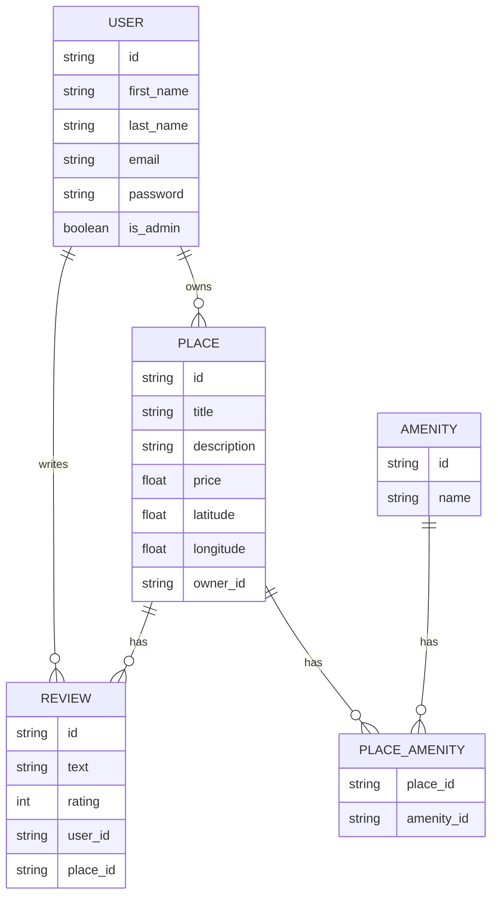

# 📘 HBNB RESTful API Project - Part3

This part of the project extends the RESTful features of the HBNB platform with several key enhancements. It introduces a persistent SQL database, a secure authentication system (including password hashing), and relational data models (e.g., users, places, reviews). These additions make the backend more reliable, structured, and secure, bringing it closer to the standards used in real-world web applications.

---

## 🚀 How to Run the Project

1. Clone the project.`git clone https://github.com/JeffToken31/holbertonschool-hbnb`

2. (Optional) Create a virtual environment.`python -m venv venv`

    2.2 To activate on Linux/Mac: `source venv/bin/activate`

    2.3 To activate on Windows: `venv\Scripts\activate`

3. Install the dependencies with `pip install -r requirements.txt`.

4. Run the app using `python run.py`.

    By default, the server starts at `http://localhost:5000`.

---

## 🗂️ Project Structure and File Descriptions

### 👁️ Overview

You can view the project structure by running: `tree`:

```
.
└── hbnb
    ├── README.md
    ├── app
    │   ├── __init__.py
    │   ├── api
    │   │   ├── __init__.py
    │   │   └── v1
    │   │       ├── __init__.py
    │   │       ├── admin.py
    │   │       ├── amenities.py
    │   │       ├── auth.py
    │   │       ├── place.py
    │   │       ├── review.py
    │   │       └── users.py
    │   ├── extends.py
    │   ├── models
    │   │   ├── __init__.py
    │   │   ├── amenities.py
    │   │   ├── baseModel.py
    │   │   ├── place.py
    │   │   ├── review.py
    │   │   └── users.py
    │   ├── persistence
    │   │   ├── __init__.py
    │   │   └── repository.py
    │   ├── services
    │   │   ├── __init__.py
    │   │   └── facade.py
    │   ├── test_models
    │   │   ├── test_all_models.py
    │   │   ├── test_amenity.py
    │   │   ├── test_place.py
    │   │   ├── test_review.py
    │   │   └── test_user.py
    │   └── tests
    │       ├── test_amenity.py
    │       ├── test_place.py
    │       ├── test_review.py
    │       └── test_user.py
    ├── config.py
    ├── extensions.py
    ├── instance
    │   └── development.db
    ├── requirements.txt
    ├── run.py
    └── sql
        ├── crud.sql
        ├── initial_datas.sql
        ├── passwd_hasher.py
        ├── tables_creation.sql
        └── uuid_generator.py
```

### 📄 `README.md`

- This file.
 It explains how the project is structured and how to run it.

### 📄 `run.py`

- This is the **entry point** of the application. Run this file to start the server.
- It loads the configuration and launches the web server.

### 📄 `config.py`

- Contains configuration settings (like server port or debug mode).
- You can adjust this file if you want to change how the app runs.

### 📄 `requirements.txt`

- Lists all the Python packages the project needs.
- You install them using `pip install -r requirements.txt`.

### 📄 `extensions.py`

- Defines and initializes Flask extensions used throughout the project (e.g., database, authentication).

- Centralizes extension instances to be imported easily in other parts of the app.

### 📄 `sql/`

- Contains SQL scripts and utilities related to the database setup and data manipulation:

    `crud.sql`

    - Contains SQL commands for Create, Read, Update, and Delete operations on database tables.

    `initial_datas.sql`

    - Inserts initial seed data into the database to populate tables with example content.

    `passwd_hasher.py`

    - Python utility for hashing and verifying passwords securely before storing them.

    `tables_creation.sql`

    - SQL script that defines and creates all necessary database tables and schemas.

    `uuid_generator.py`

    - Utility to generate unique identifiers (UUIDs) used as primary keys for database records.


### 📄 `instance/`

- Contains environment-specific files and database storage:

    `development.db`

    - SQLite database file used during development to store all persistent data locally.

---

## 📁 `app/` – Main Application Code

This folder holds all the logic for how the app works.

### 📄 `app/__init__.py`

- Tells Python that `app` is a package.
- Used to initialize things if needed when the app is loaded.

### 📄 `app/extends.py`

- Initializes key Flask extensions used throughout the project.

    `bcrypt`: handles password hashing and verification for security.

    `jwt`: manages authentication and JWT token handling.

    `db`: SQLAlchemy instance to interact with the database via ORM.

---

### 📁 `app/api/` – The API Routes (What the user can request)

This folder contains the files that define the available API endpoints (URLs the frontend or a user can call).

#### 📄 `app/api/__init__.py`

- Prepares the API module for usage.

#### 📁 `app/api/v1/`

- This is version 1 of the API.

Files inside:

- `amenities.py`: defines routes (GET, POST, etc.) for amenities (e.g. a swimming pool).
- `place.py`: defines routes related to places (e.g. homes or apartments).
- `review.py`: defines routes for handling user reviews.
- `users.py`: defines routes for user actions (create account, list users, etc.).
- `auth.py`: manages user authentication and JWT token generation.
- `admin.py`: contains admin-only routes for managing users and amenities with proper access control.
- `__init__.py`: groups all these files so they can be used together in the app.


### 📝 Snippet code of an API route (app/api/auth.py)

```python
@api.route('/login')
class Login(Resource):
    @api.expect(login_model)
    def post(self):
        """Authenticate user and return a JWT token"""
        credentials = api.payload

        user = facade.get_user_by_email(credentials['email'])
        if not user or not user.verify_password(credentials['password']):
            return {'error': 'Invalid credentials'}, 401

        access_token = create_access_token(identity={'id': str(user.id), 'is_admin': user.is_admin})
        return {'access_token': access_token}, 200
```

This code defines a POST endpoint to authenticate users by verifying their email and password. If successful, it returns a JWT token; otherwise, it responds with an error.

---

### 📁 `app/models/` – The Data Models (Python classes)

This is where you write your **Python classes** for each type of object in the app (called “models”).

Each file defines a class with attributes (like name, description, etc.) and methods (functions that the object can do).

Files inside:

- `baseModel.py`: defines the BaseModel class, a foundation for other models that provides unique IDs and timestamp management (creation and update times).
- `amenities.py`: defines the Amenity model (e.g. gym, Wi-Fi).
- `place.py`: defines the Place model (e.g. a house with location, price, etc.).
- `review.py`: defines the Review model (e.g. rating, comment).
- `users.py`: defines the User model (name, email, etc.).
- `__init__.py`: makes this folder a Python package.

### 📝 Snippet code of a data model (app/models/place.py)

```python
class Place(BaseModel):
    """
    Define Place class
    """
    __tablename__ = 'places'

    title = db.Column(db.String(100), nullable=False)
    price = db.Column(db.Float(precision=2), nullable=False)
    latitude = db.Column(db.Float(precision=6), nullable=False)
    longitude = db.Column(db.Float(precision=6), nullable=False)
    owner_id = db.Column(db.String(36), db.ForeignKey('users.id', ondelete='CASCADE'), nullable=False)
    description = db.Column(db.String(516), nullable=True)

    reviews = db.relationship('Review', backref='place', lazy=True, cascade='all, delete-orphan', passive_deletes=True)
    amenities = db.relationship('Amenity', secondary=place_amenity, backref='places', lazy=True)
```

This code defines a `Place` model with attributes such as title, price, latitude, longitude, and an optional description. It includes a foreign key `owner_id` that links each place to a user (the owner). The model also establishes two relationships: a one-to-many link with `Review` (a place can have multiple reviews) and a many-to-many association with `Amenity` (a place can offer several amenities, and each amenity can belong to multiple places).


👉 You will **add methods** in these files (like `to_dict()`, `update()`, etc.) to define what each model can do.

---

### 📁 `app/persistence/` – Saving and Loading Data

This folder contains the persistence layer, which defines how data is stored and retrieved, whether in memory or in a database. The main file, `repository.py`, defines a generic `Repository` interface with standard methods like `add()`, `get()`, `update()`, and `delete()`, and provides multiple implementations.

- `InMemoryRepository` uses a Python dictionary to store objects temporarily, making it ideal for testing.

- `SQLAlchemyRepository` handles database interactions using SQLAlchemy and is extended by `UserRepository`, `PlaceRepository`, `AmenityRepository`, and `ReviewRepository`, each targeting a specific model. `UserRepository` also includes a method for retrieving users by email.

The `__init__.py` file simply makes this folder a Python package.

### 📝 Snippet code of a persistence class (app/persistence/repository.py)

```python
class InMemoryRepository(Repository):
    def __init__(self):
        self._storage = {}

    def add(self, obj):
        self._storage[obj.id] = obj
```

This example shows how the InMemoryRepository works: it stores each object in a dictionary using the object’s ID as a key, making it easy to retrieve, update, or delete later. This pattern is particularly useful for development or unit testing without a real database.

👉 This layer helps you keep the storage logic **separate** from your business logic and routes.

---

### 📁 `app/services/` – Application Logic (The Facade)

This is where the core logic of the app lives — between the API and the database. It handles the validation, coordination, and orchestration of operations involving multiple entities (users, places, reviews, etc.).

Files inside:

- `facade.py`: the central manager of the app logic. It's designed as a singleton to ensure only one instance is used across the app, maintaining consistency and shared state if needed.

- It uses repository classes to interact with the database, and exposes high-level methods like `create_user()`, `get_place()`, or `update_review()` that the API routes can directly call.

- `__init__.py`: marks the folder as a Python package.

### 📝 Snippet code of a service function (app/services/facade.py)

```python
def get_place(self, place_id):
    place = self.place_repo.get(place_id)
    if not place:
        raise ValueError("Place not found.")
    return place
```

This function fetches a place by its ID. If it doesn’t exist, it raises an error. It’s part of the app logic that ensures proper checks before returning or modifying data.

👉 The facade encapsulates all business logic, ensures data is validated, and acts as the bridge between the repositories and the API routes.

---

## 🌐 API Endpoints


### 🛡️ Admin

| Method | Endpoint                          | Description                                 |
|--------|-----------------------------------|---------------------------------------------|
| POST   | /api/v1/admin/users                     | Create a new user (Admin only)              |
| PUT    | /api/v1/admin/users/<user_id>           | Modify any user details (Admin only)        |
| POST   | /api/v1/admin/amenities                 | Add a new amenity (Admin only)              |
| PUT    | /api/v1/admin/amenities/<amenity_id>    | Modify amenity details (Admin only)         |
| PUT    | /api/v1/admin/places/<place_id>         | Modify any place (Admin bypass ownership)   |
| PUT    | /api/v1/admin/reviews/<review_id>       | Modify any review (Admin bypass ownership)  |
| DELETE | /api/v1/admin/reviews/<review_id>       | Delete any review (Admin bypass ownership)  |

### 👤 Users

| Method | Endpoint                | Description             |
|--------|-------------------------|-------------------------|
| GET    | /api/v1/users           | List all users          |
| POST   | /api/v1/users           | Create a new user       |
| GET    | /api/v1/users/<user_id> | Get user details by ID  |
| PUT    | /api/v1/users/<user_id> | Modify user details     |

---

### 🏠 Places

| Method | Endpoint                 | Description             |
|--------|--------------------------|-------------------------|
| GET    | /api/v1/places           | Get all places          |
| POST   | /api/v1/places           | Add a new place         |
| GET    | /api/v1/places/<place_id>| Get place details by ID |
| PUT    | /api/v1/places/<place_id>| Update place details    |

---

### ⭐ Reviews

| Method | Endpoint                            | Description                        |
|--------|-----------------------------------|----------------------------------|
| GET    | /api/v1/reviews                   | List all reviews                  |
| POST   | /api/v1/reviews                   | Submit a new review               |
| GET    | /api/v1/reviews/<review_id>       | Get review details by ID          |
| PUT    | /api/v1/reviews/<review_id>       | Update review details             |
| DELETE | /api/v1/reviews/<review_id>       | Delete a review                   |
| GET    | /api/v1/places/<place_id>/reviews | List reviews for a specific place|

---

### 🚿 Amenities

| Method | Endpoint                      | Description               |
|--------|-------------------------------|---------------------------|
| GET    | /api/v1/amenities            | List all amenities        |
| POST   | /api/v1/amenities            | Add new amenity           |
| GET    | /api/v1/amenities/<amenity_id> | Get amenity details by ID|
| PUT    | /api/v1/amenities/<amenity_id> | Update amenity details   |

---

## 🧪 Testing the Endpoints Using cURL

You can test your API routes using cURL in your terminal.
Here’s how to test user creation with valid data:

📤 Create a User

```bash
curl -X POST "http://127.0.0.1:5000/api/v1/users/" -H "Content-Type: application/json" -d '{
      "first_name": "John",
      "last_name": "Doe",
      "email": "john.doe@example.com"
}'
```

✅ Expected Response (Status: 200 OK)

```bash
{
  "id": "3fa85f64-5717-4562-b3fc-2c963f66afa6",
  "first_name": "John",
  "last_name": "Doe",
  "email": "john.doe@example.com"
}


// 200 OK
```
---

## 🧪 Testing Invalid Data for a User

You can also test how the API handles invalid input data. Here’s an example where the user data is invalid (empty names and bad email):

📤 Create a User with Invalid Data

```bash
curl -X POST "http://127.0.0.1:5000/api/v1/users/" \
     -H "Content-Type: application/json" \
     -d '{
           "first_name": "",
           "last_name": "",
           "email": "invalid-email"
         }'
```

❌ Expected Response (Status: 400 Bad Request)

```json
{
  "error": "Invalid input data"
}
```
---

## 📚 Swagger Documentation Access

When you start the server, visiting the base URL:

<http://127.0.0.1:5000/>

won’t show the API documentation — this is expected.

To access the Swagger UI, which documents and allows you to test all API endpoints, go to:

<http://127.0.0.1:5000/api/v1/docs>

This page is automatically generated by Flask-RESTx based on your API models and helps you explore the API, see request/response details, and try out endpoints interactively.

---

## 🔍 Running Unit Tests with unittest

You can run your unit tests using Python’s built-in **unittest** module. For example, to run the tests in the **test_amenity.py** file, use this command in your terminal:

```python
python3 -m unittest app.tests.test_amenity
```

This will execute all test methods inside the TestAmenityEndpoints class (and any others in the file).

Here’s a sample test file for reference:

```python
import unittest
from app import create_app

class TestAmenityEndpoints(unittest.TestCase):

    def setUp(self):
        self.app = create_app()
        self.client = self.app.test_client()

    def test_create_amenity(self):
        response = self.client.post('/api/v1/amenities/', json={"name": "wifi"})
        self.assertEqual(response.status_code, 201)
```

If your tests pass, you will see a message like this in the terminal:

```bash
.....
----------------------------------------------------------------------
Ran 5 tests in 0.083s

OK
```

This means all tests ran successfully without errors.

---

## 🗃️ Database Implementation

This project uses SQLAlchemy as an ORM to manage a relational database (MySQL or SQLite). Each model (`User`, `Place`, `Review`, etc.) corresponds to a table with typed columns, constraints, and foreign keys. Relationships are explicitly declared (e.g., One-to-Many between User and Place, Many-to-Many between `Place` and `Amenity` via an association table).

<br>

All `CRUD operations` are handled via a shared `SQLAlchemy session`, ensuring data consistency and transaction control. This setup enables efficient querying, filtering, and relationships similar to those used in real-world applications.

---

### 📊 Relational Database Model

The diagram below outlines the database structure used in this project. It shows the main entities (users, places, reviews, etc.) and how they relate to one another. This relational model is implemented using SQLAlchemy to ensure consistent and scalable data management.




#### User owns Place
`Relation: USER ||--o{ PLACE`
- A user (USER) can own multiple places (PLACE).
Each place is linked to a single owner (owner_id).
This represents a one-to-many relationship between user and place.

#### User writes Review
`Relation: USER ||--o{ REVIEW`
- A user can write multiple reviews (REVIEW).
Each review is linked to a single user (user_id).
One-to-many relationship between user and review.

#### Place has Review
`Relation: PLACE ||--o{ REVIEW`
- A place can have multiple reviews.
Each review is linked to a single place (place_id).
One-to-many relationship between place and review.

#### Place includes Place_amenity
`Relation: PLACE ||--o{ PLACE_AMENITY`
- A place can have multiple associations with amenities via the PLACE_AMENITY table.
This table links a place to multiple amenities.
One-to-many relationship between place and PLACE_AMENITY.

#### Amenity listed_in Place_amenity
`Relation: AMENITY ||--o{ PLACE_AMENITY`
- An amenity (AMENITY) can be linked to multiple places via the PLACE_AMENITY table.
One-to-many relationship between amenity and PLACE_AMENITY.

---

### 📦 Dependencies to install


To run this project (Part 3: Authentication and Database), install the following Python libraries using pip:

```
pip install Flask Flask-JWT-Extended Flask-Bcrypt Flask-SQLAlchemy mysqlclient
```

- **Flask**: Lightweight and flexible web framework

<br>

- **Flask-JWT-Extended**: JWT token management for secure authentication

<br>

- **Flask-Bcrypt**: Secure password hashing

<br>

- **Flask-SQLAlchemy**: ORM for database manipulation (SQLite for development, MySQL for production)

<br>

- **mysqlclient**: MySQL client, required only for production environments using MySQL

`Note: SQLite is used by default in development, so mysqlclient is optional and only needed for production setup.`

---

### 🔍 Exploring a Practical SQL Query

```
SELECT
    first_name,
    last_name,
    title,
    price
FROM
    users
    JOIN places ON users.id = places.owner_id;
```
#### Query Breakdown:

- **Tables involved**:
This query uses two tables: `users` and `places`.


- **Purpose**:
The goal is to fetch information about users and the places they own. Specifically, it retrieves each user's first and last names along with the title and price of their owned places.


- **The JOIN operation**:
The `JOIN` clause combines rows from both tables based on a condition. Here, the condition `users.id = places.owner_id` matches each place to its owner by linking the user's unique ID (`users.id`) with the owner ID recorded in the `places table` (`owner_id`).


- **Result**:
For every user who owns at least one place, the query returns a row per place showing:

    - The user's `first_name` and `last_name`

    - The place’s `title` and `price`


- **Important note**:
Users without any owned places will not appear in the result because `JOIN` (which is an INNER JOIN) only returns matched records.

---

## 🔧 Technologies & Tools

<p align="center">
  
  
  
  
  
  
  
  
  
  
  
  
  
  
</p>

---

## 🧠 Additional Notes

- All endpoints are under the `/api/v1` path.
- The code follows the structure:
  `routes (api)` → `facade (services)` → `repository (persistence)` → `models`.
- The facade is **singleton-based**: only one instance exists to handle logic, which helps avoid bugs and confusion.
- You can easily extend the project by adding new models, routes, or features.

---

## 🧑‍🏫 Authors

👨‍💻 Louis Manchon: <https://github.com/LouisManchon>

👨‍💻 Jeffrey Basset: <https://github.com/JeffToken31>
